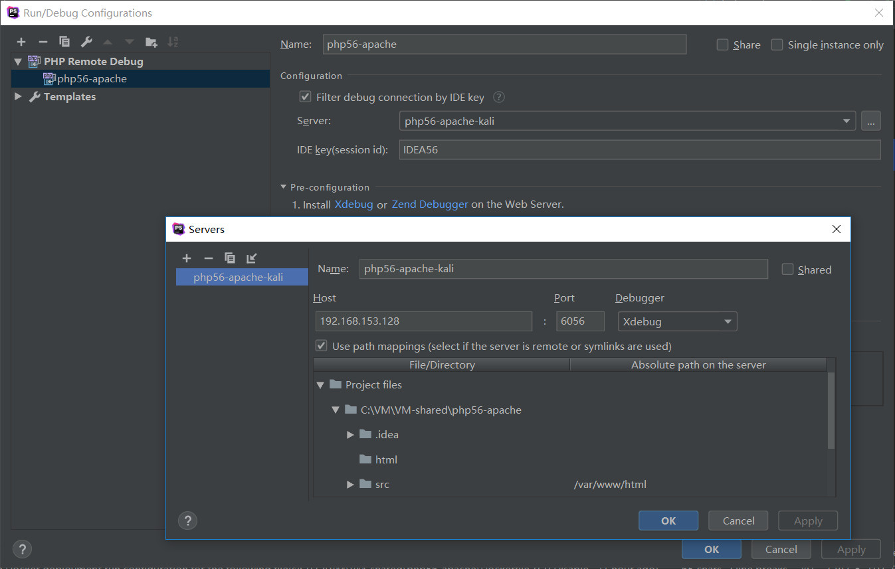

## 如何使用PhpStorm进行远程调试(xdebug)

### 远程php环境要求
1. docker installed
2. docker-compose installed
3. 远程php代码映射至本地(比如虚拟机本地共享方式)

### 本地PhpStorm配置
1. RUN -> EDIT CONFIGURATIONS -> + -> PHP REMOTE DEBUG

> 参考配置: 

### 如何触发断点
> curl ipaddress/a.php?XDEBUG_SESSION_START=**IDE_key**